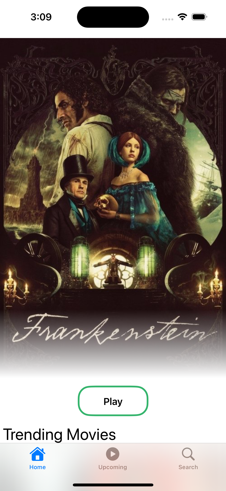
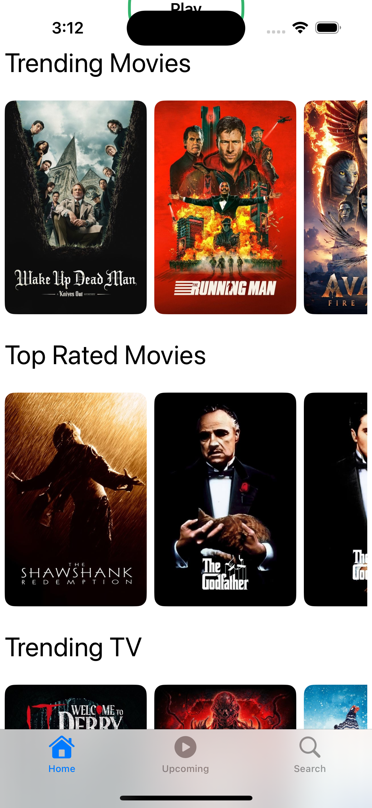
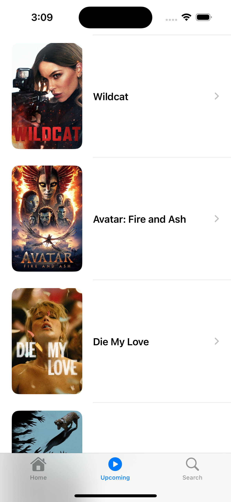
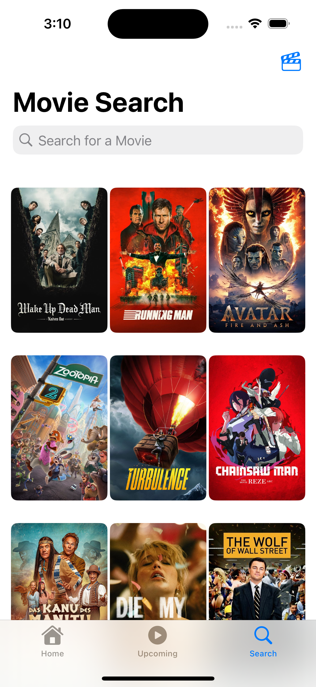
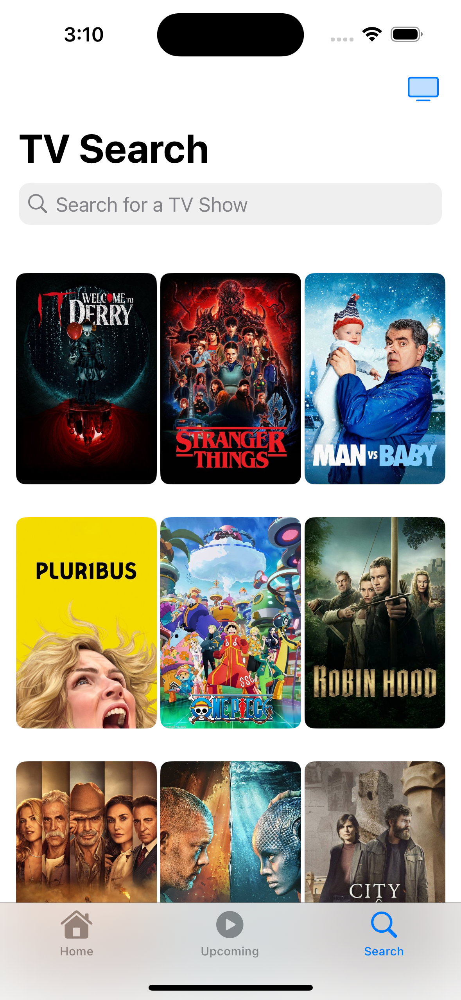
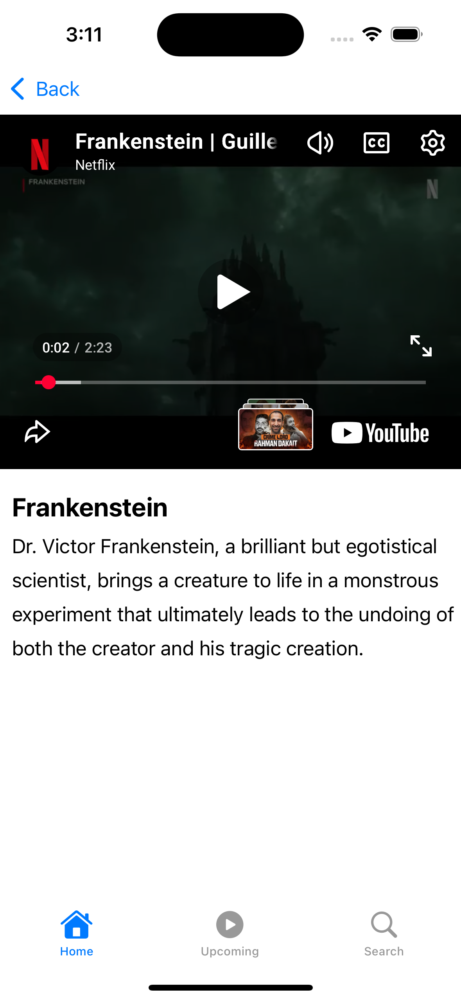

# The Next View

**The Next View** is a modern iOS application designed for discovering Movies and TV Shows. Built with **SwiftUI** and following the **MVVM** architecture, it provides a seamless and immersive experience for users to explore trending content, search for their favorites, and watch trailers.


## 🌟 Features

*   **Discover**: Browse curated lists of Trending Movies, Top Rated Movies, Trending TV Shows, and Top Rated TV Series.
*   **Search**: Powerful search functionality to find specific movies or TV shows instantly.
*   **Upcoming**: Stay ahead with a dedicated view for upcoming movie releases.
*   **Detailed Insights**: View comprehensive details including overviews and posters.
*   **Watch Trailers**: Integrated YouTube player to watch trailers directly within the app (powered by `YouTubePlayerKit`).
*   **Modern UI**: A clean, responsive, and visually appealing interface built with SwiftUI.

## 📸 Screenshots

### Discover & Browse
<div style="display: flex; flex-wrap: wrap; gap: 10px;">
  
  
  
</div>

### Search & Play
<div style="display: flex; flex-wrap: wrap; gap: 10px;">
  
  
  
</div>

## 🛠 Tech Stack

*   **Language**: Swift 5+
*   **UI Framework**: SwiftUI
*   **Architecture**: MVVM (Model-View-ViewModel)
*   **Concurrency**: Swift Concurrency (Async/Await)
*   **Networking**: URLSession
*   **External Libraries**: 
    *   [YouTubePlayerKit](https://github.com/SvenTiigi/YouTubePlayerKit) (for playing trailers)
*   **API**: [The Movie Database (TMDB)](https://www.themoviedb.org/) for data.

## 🚀 Getting Started

1.  **Clone the repository**:
    ```bash
    git clone https://github.com/muneeb-shahid/The-Next-View.git
    ```
2.  **Open the project**:
    Open `The Next View.xcodeproj` in Xcode.
3.  **Install Dependencies**:
    The project uses Swift Package Manager. Xcode should automatically fetch `YouTubePlayerKit`. If not, go to `File > Packages > Resolve Package Versions`.
4.  **API Configuration**:
    *   Ensure you have a valid API Key from TMDB.
    *   Update the `APIConfig.json` or configuration file with your keys (if applicable).
5.  **Run**:
    Select your target simulator or device and hit **Run (Cmd+R)**.

## 📁 Project Structure

The project is organized efficiently:
*   `Models`: Data structures and API response models.
*   `Views`: SwiftUI views for different screens (`HomeView`, `TitleDetailView`, etc.).
*   `ViewModels`: Business logic and state management (`HomeViewModel`).
*   `Services`: Networking and data fetching logic.
*   `Components`: Reusable UI elements (`YoutubePlayer`, `HorizontalListView`).
*   `Utils`: Constants and helpers.

## ✍️ Author

Created by **Muneeb Shahid**.

---
*Enjoy exploring The Next View!*
